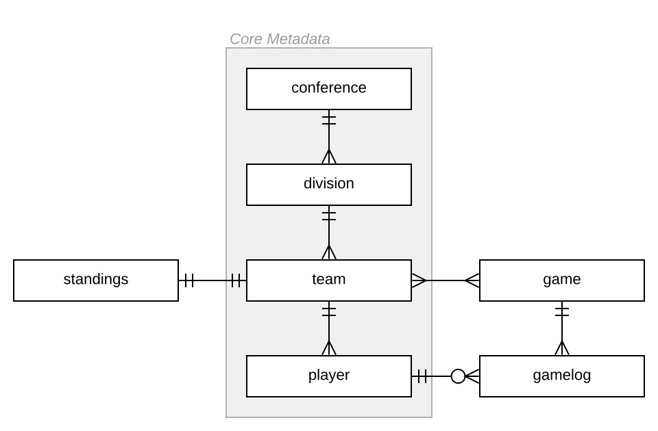

# ETL from NHL API to SQLite Database

**Table of Contents**

* [Data Flow Diagram](https://github.com/joeylafyatis/nhl-api-etl/blob/master/README.md#data-flow-diagram) 
* [Table Specifications](https://github.com/joeylafyatis/nhl-api-etl/blob/master/README.md#table-specifications) 
* [Entity-Relationship Diagram](https://github.com/joeylafyatis/nhl-api-etl/blob/master/README.md#entity-relationship-diagram)

The Python script in this repo ([*refresh_db.py*](https://github.com/joeylafyatis/nhl-api-etl/blob/master/refresh_db.py)) iterates through a dictionary of table specifications ([*table_specs.json*](https://github.com/joeylafyatis/nhl-api-etl/blob/master/table_specs.json)) that define available endpoints from the NHL's public API ([documentation by Drew Hynes](https://gitlab.com/dword4/nhlapi)) and transforms the requested data into a normalized relational database structure. The script relies primarily on the *pandas* library to build DataFrames and load them into a SQLite database file for further querying and analysis ([*nhl.db*](https://github.com/joeylafyatis/nhl-api-etl/blob/master/nhl.db)).

## Data Flow Diagram


Each table specification in [*table_specs.json*](https://github.com/joeylafyatis/nhl-api-etl/blob/master/table_specs.json) defines the elements required by [*refresh_db.py*](https://github.com/joeylafyatis/nhl-api-etl/blob/master/refresh_db.py) to (1) request data from an NHL API endpoint, (2) select the appropriate user-defined functions for transformation, and (3) create and insert the output into a table with the desired columns, headers, and data types.


## Table Specifications

Table specifications implement the following structure:

```python
"table_name": {               #names SQL table and identifies non-standard refresh functions
  "standard_refresh": bool,   #whether the specification follows an identified standard pattern
  "api_endpoint": str,        #relevant NHL API endpoint from which to request data
  "select_col": [             #list of columns from DataFrame to be loaded into SQL table
    "columnA",
    "columnB",
    "columnC",
    ...
  ],     
  "rename_col": [             #list of headers for the columns in "select_col"
    "column_a",
    "column_b",
    "column_c",
    ...
  ],   
  "cast_dtypes": {            #dictionary of data types to cast for the columns in "rename_col"
    "column_b": "integer",
    "column_c": "integer"
  }
}
```

## Entity-Relationship Diagram


There are many variations of passages of Lorem Ipsum available, but the majority have suffered alteration in some form, by injected humour, or randomised words which don't look even slightly believable. If you are going to use a passage of Lorem Ipsum, you need to be sure there isn't anything embarrassing hidden in the middle of text. All the Lorem Ipsum generators on the Internet tend to repeat predefined chunks as necessary, making this the first true generator on the Internet. 

### Core Metadata

It uses a dictionary of over 200 Latin words, combined with a handful of model sentence structures, to generate Lorem Ipsum which looks reasonable. The generated Lorem Ipsum is therefore always free from repetition, injected humour, or non-characteristic words etc.

## Happy Birthday!
To the Golden Knights fan in my life that inspired this project :)
